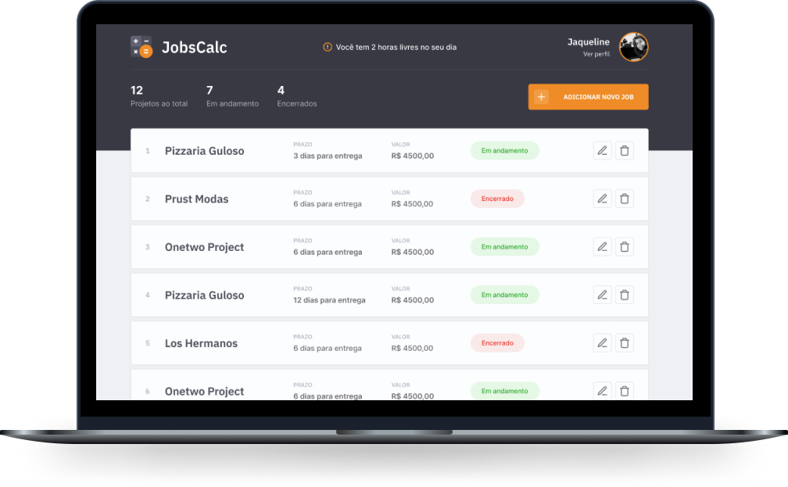
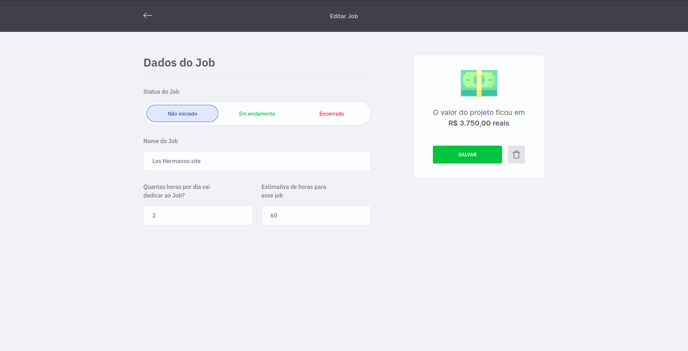

<p align="center">
  

  
  
  <a href="https://github.com/glaubermatos/jobscalc/commits/master">
    
  </a>
    
   
  
</p>

<h1 align="center">
    
    <br />
    <br />
    <br />
    
</h1>


<h4 align="center"> 
	🚧  Aplicação finalizada! 🚧
</h4>

## 🏁 Tópicos

<p>
 👉<a href="#-sobre-o-projeto" style="text-decoration: none; "> Sobre</a> <br/>
👉<a href="#-funcionalidades" style="text-decoration: none; "> Funcionalidades</a> <br/>
👉<a href="#-melhorias" style="text-decoration: none; "> Melhorias</a> <br/>
👉<a href="#-layout" style="text-decoration: none"> Layout</a> <br/>
👉<a href="#-demonstracao" style="text-decoration: none"> Demonstração</a> <br/>
👉<a href="#-como-executar-o-projeto" style="text-decoration: none"> Como executar</a> <br/>
👉<a href="#-tecnologias" style="text-decoration: none"> Tecnologias</a> <br/>
👉<a href="#-autor" style="text-decoration: none"> Autor</a> <br/>
👉<a href="#-user-content--licença" style="text-decoration: none"> Licença</a>

</p>

## 💻 Sobre o projeto

Uma aplicação para cadastrar e calcular o valor dos seus projetos freelancers de forma simples e fácil. Crie seu perfil com Github, complete seu perfil informando seu planejameno financeiro e pronto, o sistema irá calcular o valor da sua hora de trabalho.

Cadastre seus freelas informando a quantidade de horas estimada para sua conclusão e o sistema calcula o valor do Job com base no valor da sua hora de trabalho.

Esta versão do JobsCalc foi desenvolvido com a intenção de consolidar os conhecimentos com as tecnologias NextJS (front-end) e Spring (back-end). O back-end pode ser encontrado **[AQUI](https://github.com/glaubermatos/jobscalc-api)**

O projeto original jobscalc é construído com um servidor NodeJS, EJS para template engine e SQLite como banco de dados, pode ser desenvolvido acessando a **[Maratona Discover 2](https://maratonadiscover.rocketseat.com.br/maratona/aula-01)** da Rocketseat.

Então, confira o resultado no link abaixo:

<a align="center" href="https://jobscalc-glauber.vercel.app/">
    
</a>

---

<a name="-funcionalidades"></a>

## ⚙️ Funcionalidades

- [x] Front-end;
  - [x] Página:
    - [x] de Login com Github;
    - [x] Principal listando os jobs em andamento, encerrados e não iniciado;
    - [x] do perfil para configurar o planejamento de estimativas de ganhos e horas de trabalho;
    - [x] para cadastro de jobs;
    - [x] para editar jobs;
    - [x] modal para deletar jobs;
  - [x] Autenticação com Next-Auth;
  - [x] Rotas privadas para usuários não autenticados;
  - [x] Notificações com Toastify;
  - [x] Versão web mobile;
- [x] API Routes
  - [x] Perfil
    - [x] POST /api/profiles - Cria um novo perfil de usuário
    - [x] PUT /api/profiles/[profileId] - Atualiza dados do perfil do usuário
  - [x] Jobs
    - [x] GET /api/profiles/[profileId]/jobs - Lista os jobs do perfil do usuário
    - [x] POST /api/profiles/[profileId]/jobs - Cria um novo job
    - [x] PUT /api/profiles/[profileId]/jobs/[jobId] - Atualiza dados do job
    - [x] DELETE /api/profiles/[profileId]/jobs/[jobId] - Deleta o job
    - [ ] GET /api/profiles/[profileId]/jobs/[jobId] - Lista os dados do job

---
<a name="-melhorias"></a>

## ⚙️ Melhorias
- [ ] Usar fakeAPI para remover dependência do projeto back-end em java disponível **[AQUI](https://github.com/glaubermatos/jobscalc-api)**.
- [ ] Mostrar um load de carregamento nas páginas enquanto o servidor não retorna os dados do backend
- [ ] Otimização de imagens substituindo todas as tags 'img' para o component Image do NextJS

---

## 🎨 Layout

- **[Layout Frontend](https://www.figma.com/file/1YbzIzsyRCfaDt86iUb6Lw/Jobs-Planning-Maratona-Discover2-Copy)**

- ### Personalizações no layout
  - [x] Criação do design da página de login com github.
  - [x] Customização da pagina de edição de job
    - [x] Criação de componente para alteração de status.
  - [ ] Versão para web mobile

#### Página de login com github


#### Página de edição de jobs


---

<a name="-demonstracao"></a>

## 🕹️ Demonstração

<a align="center" href="https://www.linkedin.com/posts/glaubermatos_desenvolvimentoweb-springboot-nextjs-activity-6905992105182015488-CfRu">
    
</a>

---

## 🚀 Como executar o projeto

💡O Frontend precisa que o Backend esteja sendo executado para funcionar, que pode ser encontrado **[AQUI](https://github.com/glaubermatos/jobscalc-api)**.

💡Para integração com a autenticação é preciso configurar as variáveis de ambiente para o Next-Auth se conectar com a api do Github. 

### Pré-requisitos

Antes de começar, você vai precisar ter instalado em sua máquina as seguintes ferramentas:
[Git](https://git-scm.com), [Node.js](https://nodejs.org/en/), [Yarn](https://classic.yarnpkg.com/en/docs/install).
Além disto é bom ter um editor para trabalhar com o código como [VSCode](https://code.visualstudio.com/)


#### 🧭 Rodando a aplicação web (Frontend)

```bash

# Clone este repositório
$ git clone https://github.com/glaubermatos/jobscalc.git

# Acesse a pasta do projeto no seu terminal/cmd
$ cd jobscalc

# Instale as dependências
$ yarn

# Execute a aplicação em modo de desenvolvimento
$ yarn dev

# A aplicação será aberta na porta:3000 - acesse http://localhost:3000

# É necessário configurar as variáveis de ambiente

```


#### 🧭 Configure as variáveis de ambiente

Configure o github para permitir autenticação, crie uma OAuth App **[AQUI](https://github.com/settings/developers)**.

```bash

# Copie o arquivo .env.local.example para a raiz do seu projeto renomeando para .env.local (que será ignorado pelo Git):
$ cp .env.local.example .env.local

```

Adicione detalhes para um ou mais provedores (por exemplo, Google, Twitter, GitHub, Email etc.).

Para ver detalhes da implementação do Next-Auth **[AQUI](https://next-auth.js.org/getting-started/example)**.

Saiba mais sobre o [Next-Auth](https://nextjs.org/).


---

## 🛠 Tecnologias

Este é um projeto Next.js inicializado com create-next-app.
As seguintes ferramentas foram usadas na construção do projeto:

#### **Aplicação web** ([NextJS](https://nextjs.org/) + [TypeScript](https://www.typescriptlang.org/))

- **[Next-Auth](https://next-auth.js.org/)**
- **[Axios](https://github.com/axios/axios)**
- **[React Icons](https://react-icons.github.io/react-icons/)**
- **[React Modal](http://reactcommunity.org/react-modal/)**
- **[react-toastify](https://fkhadra.github.io/react-toastify/introduction)**
- **[sass](https://sass-lang.com/)**

> Veja o arquivo [package.json](https://github.com/glaubermatos/jobscalc/blob/main/package.json)

#### **Utilitários**

- Editor: **[Visual Studio Code](https://code.visualstudio.com/)**
- Teste de API: **[Insomnia](https://insomnia.rest/)**
- Ícones: **[Feather Icons](https://feathericons.com/)**
- Fontes: **[IBM Plex Sans](https://fonts.google.com/specimen/IBM+Plex+Sans)** | **[Inter](https://fonts.google.com/specimen/Inter)**

---

<a name="-autor"></a>

## 🦸‍♂️ **Autor**

<p>
 
 <br />
 <sub><strong>🌟 Glauber de Oliveira Matos 🌟</strong></sub>
</p>

[](https://www.linkedin.com/in/glaubermatos/)

---
<a name="-user-content--licença"></a>

## 📝 Licença

Este projeto esta sobe a licença [MIT](./LICENSE).

Feito com :satisfied: por Glauber de Oliveira Matos 👋🏽 [Entre em contato!](https://www.linkedin.com/in/glaubermatos/)

---